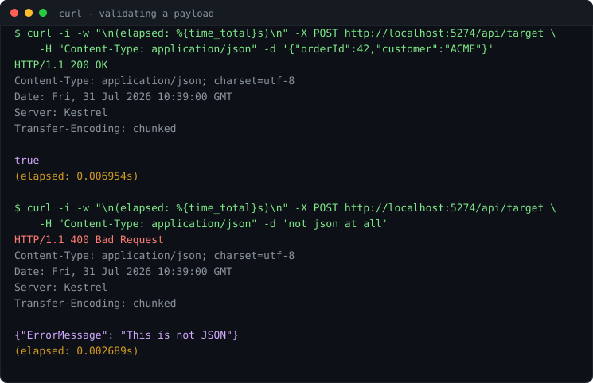
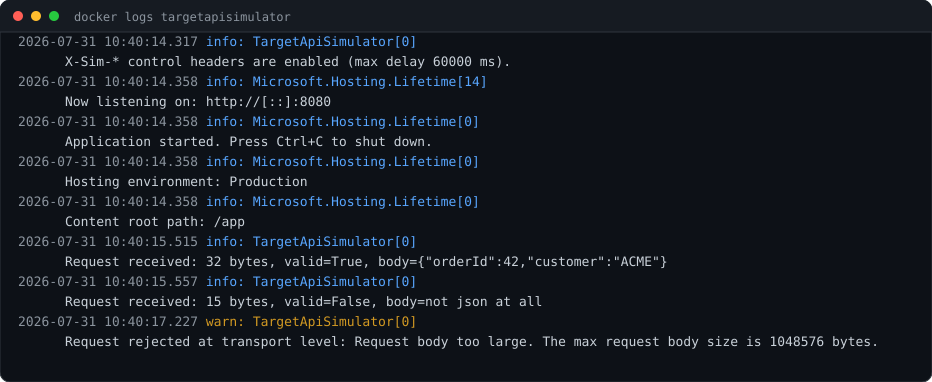
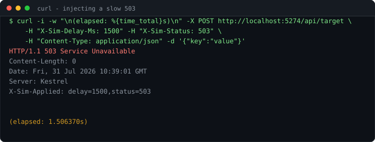

# TargetApiSimulator


## About this Project

**TargetApiSimulator** is a small ASP.NET Core API that accepts POST requests at the `/api/target` endpoint,
validates whether the incoming request body is valid JSON, and responds with the validation result.

It exists to be a *target* for something else: point your integration tests, message pipeline or HTTP client at it
and assert that what you send is well-formed JSON.

### Key Features

- Receives POST requests and validates the body as JSON
- Returns `200 OK` with `true` for valid JSON, `400 Bad Request` with an error object otherwise
- Logs every received payload to stdout (truncated at 512 characters), so you can see exactly
  what your system sent
- Ships as a container image and as a downloadable release

## Quick start

| How you run it | URL to send requests to |
|---|---|
| `dotnet run` (default `http` profile) | `http://localhost:5274/api/target` |
| `dotnet run --launch-profile https` | `https://localhost:7046/api/target` |
| `docker run --rm -p 5000:8080 mysttic/targetapisimulator` | `http://localhost:5000/api/target` |
| Release zip: `dotnet TargetApiSimulator.dll --urls http://localhost:5000` | `http://localhost:5000/api/target` |

A ready-to-run request collection is in [TargetApiSimulator.http](./TargetApiSimulator.http).

## See it running

Send a payload, get a verdict:



The console shows every request as it arrives, with the payload echoed back (truncated at 512
characters) and oversized bodies rejected before they are read:



Timestamps are **UTC** with millisecond precision, so the log lines up with whatever your system
under test writes without a timezone in the way. Change the format, or switch to local time, in
[appsettings.json](src/TargetApiSimulator/appsettings.json):

```json
{
  "Logging": {
    "Console": {
      "TimestampFormat": "yyyy-MM-dd HH:mm:ss.fff ",
      "UseUtcTimestamp": true
    }
  }
}
```

Setting `TimestampFormat` to `null` removes the timestamp. The trailing space in the format is
what separates it from the log level.

With the control headers enabled, the same endpoint can be made slow, broken, or both. The
`elapsed` figure is curl's own measurement — it confirms the injected delay actually happened:



## Endpoint

**POST** `/api/target`

Validates whether the request body is a valid JSON document.

- `200 OK`, body `true` — the payload parsed as JSON.
- `400 Bad Request`, body `{"ErrorMessage": "This is not JSON"}` — it did not.

Example request:

```http
POST /api/target
Content-Type: application/json

{
  "key": "value"
}
```

```http
200 OK

true
```

```http
400 Bad Request

{"ErrorMessage": "This is not JSON"}
```

### Validation contract

Every row below is verified against a running instance. Treat it as the API contract — a change to any of these
is a breaking change.

| Request | Result |
|---|---|
| `{"a":1}`, `[1,2,3]`, `{}`, `[]` | `200` |
| `123`, `"str"`, `true`, `false`, `null` | `200` — a bare scalar is a valid JSON document per RFC 8259 |
| `{"a":1,"a":2}` (duplicate keys) | `200` — not rejected |
| Body prefixed with a UTF-8 BOM | `200` — the BOM is stripped before parsing |
| UTF-16 body with a byte order mark | `200` — the encoding is detected from the BOM |
| Nesting depth 64 | `200` |
| Nesting depth 65 or deeper | `400` — `JsonDocument` has a maximum depth of 64 |
| Empty body, or whitespace only | `400` |
| `{"a":}`, `{"a":1,}`, `This is not JSON` | `400` |
| `{"a":1} // comment` | `400` — comments are not valid JSON |
| `{"a":1}{"b":2}` (two documents) | `400` |
| Any `Content-Type`, or none at all | Ignored — the header is never inspected |
| Body larger than 1 MB | `413` — the configured request body limit |
| Any method other than `POST` on `/api/target` | `405` with `Allow: POST` |
| Any other path | `404` |
| `/API/TARGET`, `/api/target/` | `200` — routing ignores case and a trailing slash |

Both branches respond with `Content-Type: application/json; charset=utf-8`.

### Other endpoints

| Endpoint | Response |
|---|---|
| `GET /healthz` | `200` — `{"status":"ok"}` |
| `GET /version` | `200` — `{"version":"1.0.0+<commit sha>"}` |

## Simulating a misbehaving service

To test how your system handles a slow or failing downstream, switch on the control headers. They
are **off by default**, so enabling them is the only way a caller can change how it is served:

```json
{
  "Simulator": {
    "EnableControlHeaders": true,
    "MaxDelayMs": 60000
  }
}
```

Or, without touching a file:

```bash
docker run --rm -p 5000:8080 \
  -e Simulator__EnableControlHeaders=true \
  mysttic/targetapisimulator
```

Then drive the response per request:

| Request header | Effect |
|---|---|
| `X-Sim-Delay-Ms: 2500` | Waits 2500 ms before responding. Clamped to `MaxDelayMs`. |
| `X-Sim-Status: 503` | Responds with 503 and an empty body. The endpoint never runs, so nothing is validated. |

Both headers can be combined — the delay happens first.

Whenever a control header takes effect, the response carries **`X-Sim-Applied`** listing what was
applied, for example `delay=2500,status=503`. Assert on it to tell "the stub injected this" apart
from "my own code produced this".

Values that cannot be used are ignored rather than guessed at, and `X-Sim-Applied` is then absent:
a delay must be a non-negative integer, and a status must be between 100 and 599.

The headers apply to every route, including `/healthz` — which is what you want when testing how
an orchestrator reacts to an unhealthy dependency.

```bash
curl -i -X POST http://localhost:5000/api/target \
  -H 'Content-Type: application/json' \
  -H 'X-Sim-Delay-Ms: 2000' \
  -H 'X-Sim-Status: 503' \
  -d '{"key":"value"}'
```

## Docker

Pull the published image:

```bash
docker pull mysttic/targetapisimulator
```

Or build it yourself from the [Dockerfile](./Dockerfile):

```bash
docker build -t targetapisimulator .
```

Run it. The container listens on **8080** — this is the ASP.NET Core default and it is not configurable through
the image:

```bash
docker run --rm -p 5000:8080 targetapisimulator
```

Then send requests to `http://localhost:5000/api/target`:

```bash
curl -i -X POST http://localhost:5000/api/target \
  -H 'Content-Type: application/json' \
  -d '{"key":"value"}'
```

The image is published to both [Docker Hub](https://hub.docker.com/r/mysttic/targetapisimulator) and
`ghcr.io/mysttic/targetapisimulator`.

### Image tags

| Tag | Mutability | Use it for |
|---|---|---|
| `1.2.3` | immutable | pin this in your own CI |
| `1.2` | moves with each patch | a tolerant pin |
| `latest` | moves with every release | local and manual use only |

The container runs as an unprivileged user (`uid 1654`) and listens on 8080 only.

## Get a release

Each release on the [Releases page](https://github.com/Mysttic/TargetApiSimulator/releases) ships one zip per
platform, plus a `.sha256` checksum next to it:

| Asset | Run it with |
|---|---|
| `TargetApiSimulator-<version>-win-x64.zip` | `TargetApiSimulator.exe` |
| `TargetApiSimulator-<version>-linux-x64.zip` | `./TargetApiSimulator` |
| `TargetApiSimulator-<version>-osx-arm64.zip` | `./TargetApiSimulator` |

All builds are framework-dependent, so the .NET 10 runtime has to be installed. `dotnet TargetApiSimulator.dll`
works from any of them regardless of platform.

```bash
./TargetApiSimulator --urls http://localhost:5000
```

Everything the application receives is printed to the console it runs in. Check the download first:

```bash
sha256sum -c TargetApiSimulator-1.0.0-linux-x64.zip.sha256
```

## Versioning

[VERSION.md](./VERSION.md) is the single source of truth. Nothing is tagged by hand.

```markdown
# Version

1.2.3
```

Bump that number, merge it into `master`, and [release.yml](.github/workflows/release.yml) creates
the `v1.2.3` tag and publishes the release. Merging into `master` **without** changing it does
nothing — the tag already exists, so the pipeline stops before publishing.

The version has to sit alone on its own line; a number mentioned in prose is ignored, so the
comments in that file cannot trigger a release by accident. A suffix such as `1.1.0-rc.1` is
published as a GitHub pre-release.

| Where | How the version gets in |
|---|---|
| Release build | read from `VERSION.md`, passed as `-p:Version` and `-p:InformationalVersion=<version>+<sha>` |
| Container | `docker build --build-arg VERSION=1.2.3 .` |
| Local build | `dotnet build -p:Version=1.2.3` — otherwise it is `1.0.0` |
| Verify at runtime | `curl http://localhost:5274/version` |

The container needs the build argument because [.dockerignore](./.dockerignore) excludes `.git`,
so nothing inside the build can derive the version on its own.

What each part means for this service:

- **MAJOR** — the HTTP contract changed: a status code, a response body shape, or a route.
- **MINOR** — a new endpoint or newly accepted input, backwards compatible.
- **PATCH** — bug fix, dependency bump, documentation, CI.

The validation contract table above is the reference: if one of those rows changes, so does the
major or minor number. See [CHANGELOG.md](./CHANGELOG.md) for the history and
[CONTRIBUTING.md](./CONTRIBUTING.md) for the branch and release flow.

> Releases `v5` and `v7` predate this scheme. They were numbered by CI run count and carry no
> compatibility meaning; versioning starts over at `v1.0.0`.

## Disclaimer

This is a test fixture, not a production service. It has no authentication, it prints the first 512 characters of
every payload it receives to stdout, and it is meant for trusted networks only. Do not expose it to the internet.
